<html>
<h3>Contents</h3>
<a href="#a1">Features</a> 
<a href="#a2">Login</a> 
<a href="#a3">Main - Basedata</a> 
<a href="#a4">Main - Interfaces</a> 
<a href="#a5">Interface - Interface data</a> 
<a href="#a6">Interface - Methods</a> 
<a href="#a7">Interface - Method</a> 
<a href="#a8">Interface - Method - Mockdata overview</a> 
<a href="#a9">Interface - Method - Mockdata</a> 
<a href="#a10">Usage / Integration MoSy</a> 
<a href="#a11">Main - Records</a> 
<a href="#a12">Main - Record</a> 
<a href="#a13">Main / Interface-method - Upload mockdata</a> 
<a href="#a14">Interface - Method - Recordconfigs</a> 
<a href="#a15">Interface - Method - Recordconfig</a> 
<a href="#a16">Main - Mockprofiles</a> 
<a href="#a17">Mockprofile</a> 
<a href="#a18">API-Client</a> 
<a href="#a19">Property files</a> 
<a href="#a20">Runtime environments – Spring Boot</a> 
<a href="#a21">Runtime environments – JEE ApplicationServer (JBoss / Wildfly)</a> 
 
   
<a name="a1"/>

<strong><u>Features</u></strong>

<ul>
<li>Mock all kind of interfaces
	<ul>
		<li>REST</li>
		<li>SOAP</li>
		<li>CUSTOM (XML / JSON / OTHER)
			<ul>
				<li>(Requires some implementation in calling software)</li>
				<ul><li>Predefined abstract class - see class <a href="https://github.com/joergdev/MoSy-API-client/blob/master/src/main/java/de/joergdev/mosy/api/client/AbstractCustomMockImpl.java">AbstractCustomMockImpl</a> (javadoc)</li></ul>
				<li>Examples: MQ-Interfaces, RMI-Interfaces, Native-Interfaces, &hellip;</li>
			</ul>
		</li>
		<li>Configurable global, for interface or only for method</li>
	</ul>
</li>

  

<li>Record calls and use as mockdata
	<ul>
		<li>Configurable global, for interface, for method oder only on defined requests</li>
		<li>Possibilty to define recordsession for separated records</li>
	</ul>
</li>

  

<li>Possibilty to define mockprofiles with isolated mockdata
	<ul>
		<li>Can be used for&hellip;
			<ul>
				<li>automatic tests for example where some tests needs different interface behavior by having same input data</li>
				<li>(developer) tests wihout side effects to others</li>
			</ul>
		</li>
	</ul>
</li>

  

<li>Open Rest API
	<ul>
		<li>Only one public API, used by webfronted as well</li>
	</ul>
</li>

  

<li>Runable as spring-boot-app (standalone, within container) or as JEE app.</li>

</ul>

      

<a name="a2"/>

<strong><u>Login</u></strong>

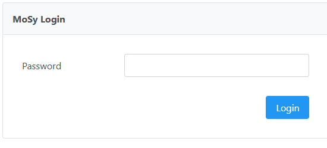

Default password: &bdquo;m0sy&ldquo;

      

<a name="a3"/>

<strong><u>Main - Basedata</u></strong>

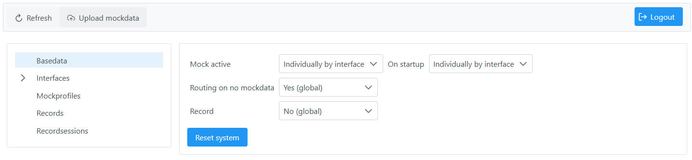
  
<ul>
<li>Global config for these values (Yes / No / Individually by interface)
<ul>
<li>&bdquo;Mock active&ldquo;
<ul>
<li>&bdquo;On startup&ldquo;
<ul>
<li>Overwrites &bdquo;Mock active&ldquo; on next Backend Boot or on &bdquo;Reset System&ldquo;</li>
</ul>
</li>
<li>&bdquo;Routing on no mockdata&ldquo;</li>
<li>&bdquo;Record&ldquo;</li>
</ul>
</li>
</ul>
</li>
</ul>
 
<ul>
<li>&bdquo;Reset system&ldquo;
<ul>
<li>Reset all config to default (&bdquo;On startup&ldquo;)</li>
<li>Reset count calls</li>
<li>Delete temporary data (non persistent mockprofiles and recordsessions)</li>
</ul>
</li>
</ul>
      

<a name="a4"/>

<strong><u>Main &ndash; Interfaces</u></strong>

<ul>
<li>Tree
<ul>
<li>Overview of interfaces grouped by type (SOAP / REST* / CUSTOM)</li>
<li>Left click on single interface =&gt; Show / Edit</li>
</ul>
</li>
<li>Table
<ul>
<li>Overview of all interfaces with possibilty to show/edit / delete or creation of a new interface</li>
<li>Columns
<ul>
<li>Type
<ul>
<li>SOAP / REST / CUSTOM_XML / CUSTOM_JSON / CUSTOM_PLAIN</li>
<li>Left click on single interface =&gt; Show / Edit</li>
</ul>
</li>
<li>Name</li>
<li>Mock active
<ul>
<li>True / false / empty (Individually by method)</li>
</ul>
</li>
<li>Record
<ul>
<li>True / false / empty (Individually by method)</li>
</ul>
</li>
</ul>
</li>
</ul>
</li>
</ul>
      

<a name="a5"/>

<strong><u>Interface &ndash; Interface data</u></strong>

<em>REST</em>

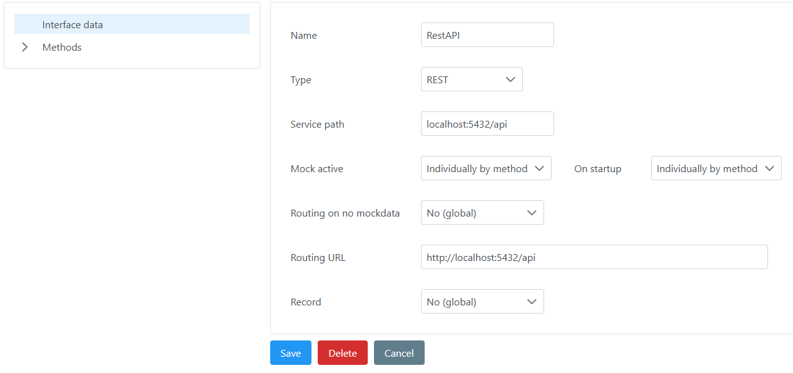

<em>SOAP</em>

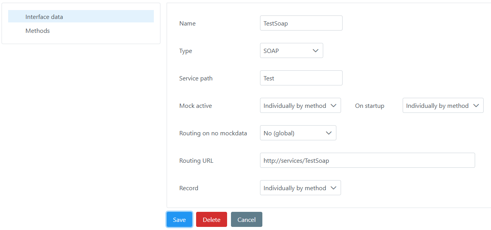

<em>CUSTOM</em>

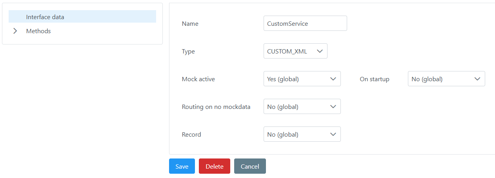
<ul>
<li>Name</li>
<li>Type
<ul>
<li>REST / SOAP / CUSTOM_XML / CUSTOM_JSON / CUSTOM_PLAIN</li>
</ul>
</li>
<li>Service path
<ul>
<li>REST: HTTP (base)path</li>
<li>SOAP: Service endpoint (in most cases equal to service name)</li>
<li>CUSTOM(XML/JSON/PLAIN): NOT visible</li>
</ul>
</li>
<li>Mock active
<ul>
<li>On startup</li>
</ul>
</li>
<li>Routing on no mockdata</li>
<li>Routing URL
<ul>
<li>Endpoint for routing on no mock (delegate to real service)</li>
<li>NOT visible for type CUSTOM(XML/JSON/PLAIN)</li>
</ul>
</li>
<li>Record</li>
</ul>
      

<a name="a6"/>

<strong><u>Interface - Methods</u></strong>

<ul>
<li>Tree
<ul>
<li>Overview of methods</li>
<li>Left click on single method =&gt; Show / Edit</li>
</ul>
</li>
<li>Table
<ul>
<li>Overview of all methods with possibilty to show/edit / delete or creation of a new method</li>
<li>Columns
<ul>
<li>Name</li>
<li>Mock active
<ul>
<li>True / false</li>
</ul>
</li>
<li>Routing on no mockdata
<ul>
<li>True / false</li>
</ul>
</li>
<li>Record
<ul>
<li>True / false / empty (Individually by recordconfig)</li>
</ul>
</li>
<li>Count calls</li>
</ul>
</li>
</ul>
</li>
</ul>
      

<a name="a7"/>

<strong><u>Interface - Method</u></strong>

<ul>
<li>Name</li>
<li>Service path
<ul>
<li>REST: HTTP (sub)path, may be empty</li>
<li>SOAP: Root XML tag name, may not be empty</li>
<li>CUSTOM(XML/JSON/PLAIN): NOT visible</li>
</ul>
</li>
<li>HTTP method
<ul>
<li>Only visible for REST Services</li>
</ul>
</li>
<li>Mock active
<ul>
<li>On startup</li>
</ul>
</li>
<li>Routing on no mockdata</li>
<li>Record
<ul>
<li>Yes (global) / No (global) / Individually by recordconfig</li>
</ul>
</li>
<li>Count calls</li>
</ul>
      

<a name="a8"/>

<strong><u>Interface - Method- Mockdata overview</u></strong>

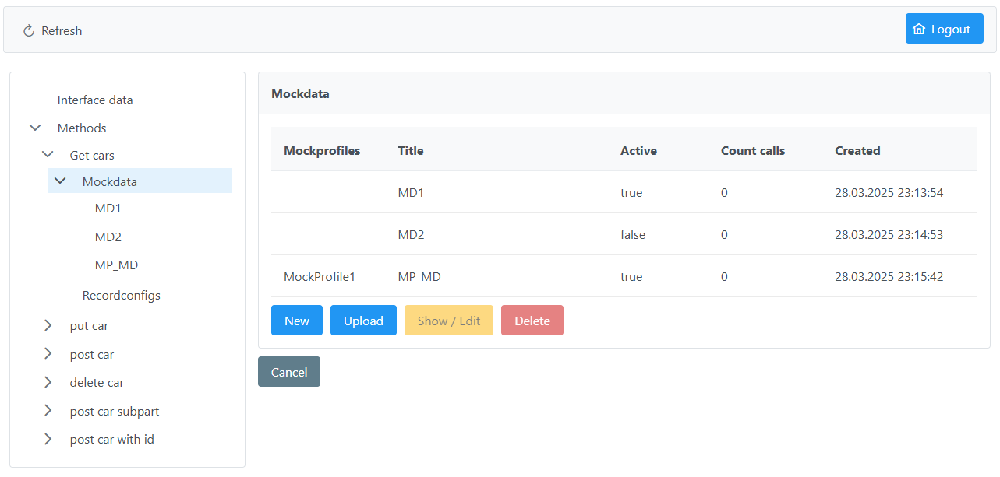
<ul>
<li>Mockprofiles
<ul>
<li>Set if mockprofile(s) assigned (see chapter for mockprofile)</li>
</ul>
</li>
<li>Title</li>
<li>Active
<ul>
<li>True / false</li>
</ul>
</li>
<li>Count calls</li>
<li>Created</li>
</ul>
      

<a name="a9"/>

<strong><u>Interface - Method- Mockdata</u></strong>

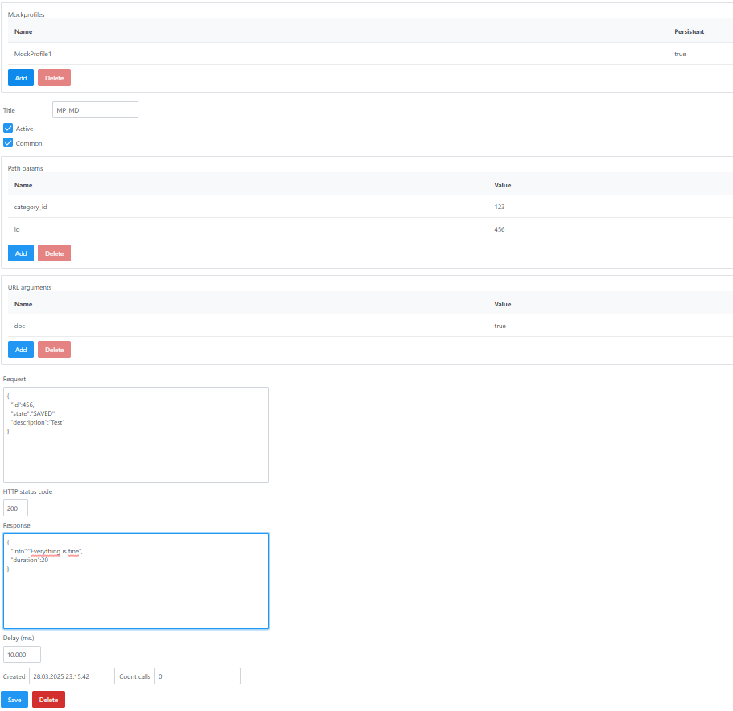
<ul>
<li>Mockprofiles (Table)
<ul>
<li>(Optional)</li>
<li>Assigned mockprofile(s) (see chapter for mockprofile)</li>
</ul>
</li>
<li>Title</li>
<li>Active</li>
<li>Common (Use for assingned mockprofiles and / or global)</li>
<li>Request</li>
<li>Response</li>
<li>Created</li>
<li>Count calls</li>
 
<li>Hashcode of request und response gets saved</li>
</ul>
      

<a name="a10"/>

<strong><u>Usage / Integration MoSy</u></strong>

<ul>
<li>SOAP
<ul>
<li>Change Endpoint (<a href="http://real-endpoint/XyzService">http://real-endpoint/XyzService</a>) to <a href="http://mosy_base_url/soap/XyzService">http://mosy_base_url/soap/XyzService</a></li>
</ul>
</li>
<li>REST*
<ul>
<li>Change Endpoint (<a href="http://real-endpoint/resource/id">http://real-endpoint/resource/id</a>) to <a href="http://mosy_base_url/rest/resource/id">http://mosy_base_url/rest/resource/id</a></li>
</ul>
</li>
<li>CUSTOM
<ul>
<li>Needs custom implementation in calling software</li>
<li>See MosyApiClient#customRequest
<ul>
<li>IN-Parameter
<ul>
<li>Interface name</li>
<li>Method name</li>
<li>Request</li>
</ul>
</li>
<li>OUT-Parameter
<ul>
<li>Record (boolean)
<ul>
<li>See MosyApiClient#saveRecord</li>
</ul>
</li>
<li>Route (boolean)</li>
<li>Response</li>
<li>Method (Object)
<ul>
<li>Required for saving record possibly</li>
</ul>
</li>
</ul>
</li>
</ul>
</li>
</ul>
</li>
</ul>
      

<a name="a11"/>

<strong><u>Main &ndash; Recordsessions</u></strong>

<ul>
<li>Overview of all recordsessions with possibilty to create new or delete.</li>
 
<li>ID</li>
<li>Created</li>
</ul>
      

<a name="a11"/>

<strong><u>Main &ndash; Records</u></strong>

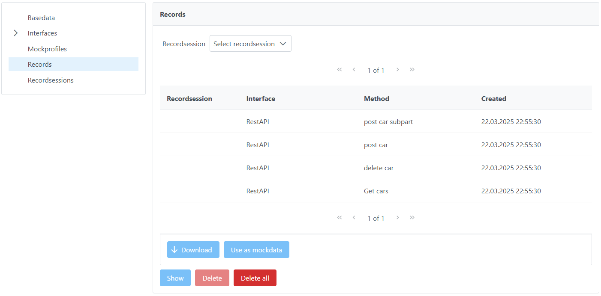
<ul>
<li>Overview of all records with possibilty to download, use as mockdata, show or delete.</li>
 
<li>Filter Recordsession (optional)</li>
 
<li>Interface</li>
<li>Method</li>
<li>Created</li>
</ul>
<ul>
<li>Download
<ul>
<li>Download record as .txt or .zip (on multiple choice)</li>
</ul>
</li>
</ul>
<ul>
<li>Use as mockdata</li>

</ul>
<ul>
<li>Record saved as mockdata for interface SoapService and method getEntries</li>
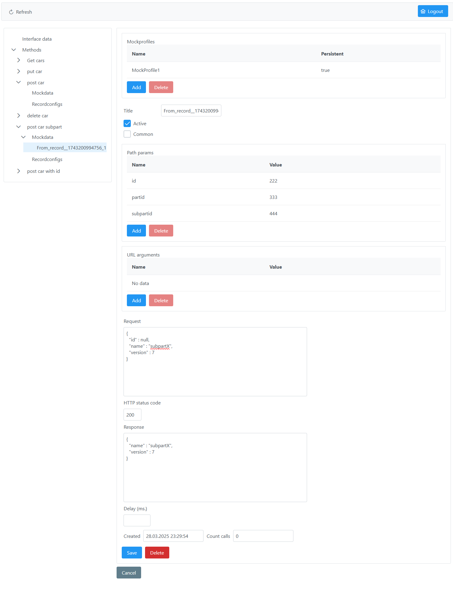
</ul>
      

<a name="a12"/>

<strong><u>Main - Record</u></strong>

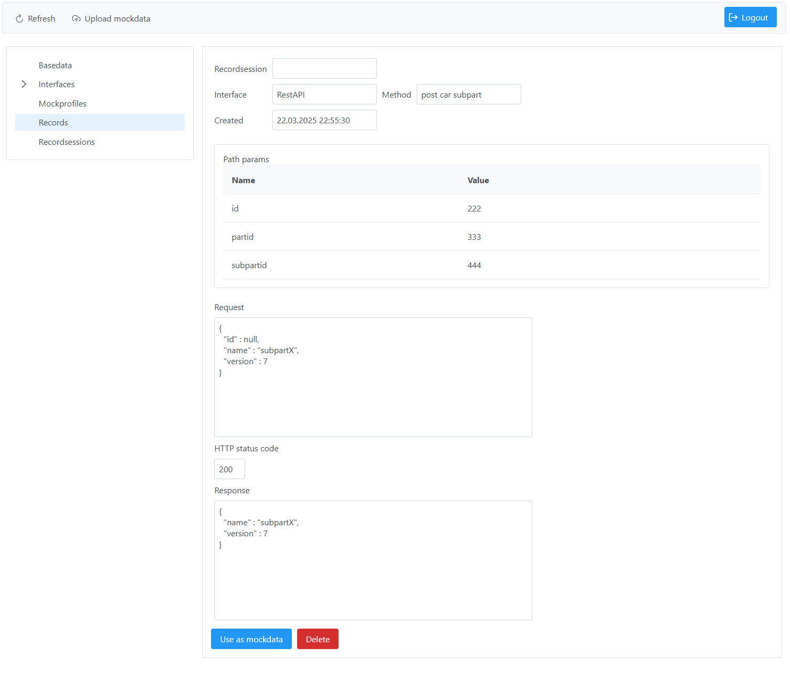
<ul>
<li>Recordsession</li>
<li>Interface</li>
<li>Method</li>
<li>Created</li>
<li>Request</li>
<li>Response</li>
</ul>
<ul>
<li>Use as mockdata
<ul>
<li>See above</li>
</ul>
</li>
</ul>
      

<a name="a13"/>

<strong><u>Main / Interface-method - Upload mockdata</u></strong>

* If upload from interface method interface and method gets prefilled

<ul>
  
<li>Choose</li>

</ul>
<ul>
<li>Upload</li>
<li>Mockdata gets saved</li>
</ul>
<ul>
<li>Filename format (otional otherwise interface and method must be provided in GUI):
<ul>
<li>[Interface-name]_[method-name]_*</li>
</ul>
</li>
</ul>
<ul>
<li>File content (example)</li>
</ul>

&gt;&gt;&gt;&gt;&gt;&gt;REQUEST&gt;

&lt;?xml version="1.0" ?&gt;&lt;S:Envelope xmlns:S="http://schemas.xmlsoap.org/soap/envelope/"&gt;&lt;S:Body&gt;&lt;ns2:testMethod xmlns:ns2="http://services.test.mosy.joergdev.github.com/"&gt;&lt;action&gt;upload_main&lt;/action&gt;&lt;/ns2:testMethod&gt;&lt;/S:Body&gt;&lt;/S:Envelope&gt;

&gt;&gt;&gt;&gt;&gt;&gt;RESPONSE&gt;

&lt;?xml version="1.0" ?&gt;&lt;S:Envelope xmlns:S="http://schemas.xmlsoap.org/soap/envelope/"&gt;&lt;S:Body&gt;&lt;ns2:testMethodResponse xmlns:ns2="http://services.test.mosy.joergdev.github.com/"&gt;&lt;return&gt;!ERROR!&lt;/return&gt;&lt;/ns2:testMethodResponse&gt;&lt;/S:Body&gt;&lt;/S:Envelope&gt;

      

<a name="a14"/>

<strong><u>Interface - Method - Recordconfigs</u></strong>

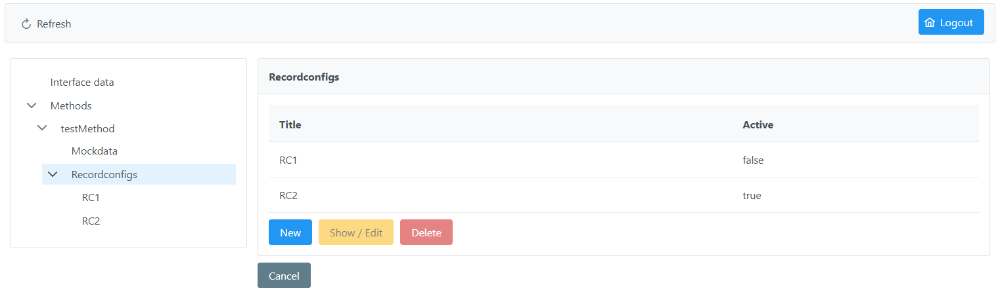
<ul>
<li>Title</li>
<li>Active (true/false)</li>
</ul>
      

<a name="a15"/>

<strong><u>Interface - Method - Recordconfig</u></strong>

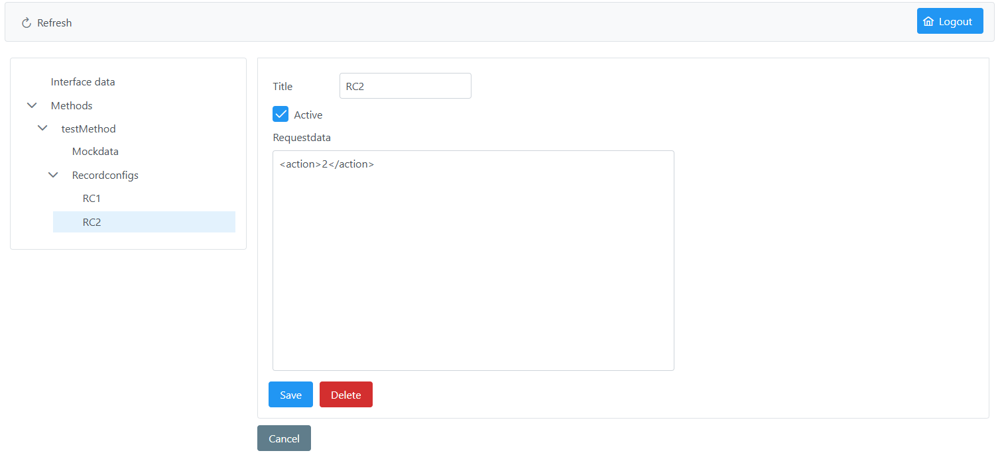
<ul>
<li>Title</li>
<li>Active</li>
<li>Requestdata
<ul>
<li>Request get recorded if matches (even if request contains more data)</li>
</ul>
</li>
</ul>
      

<a name="a16"/>

<strong><u>Main - Mockprofiles</u></strong>

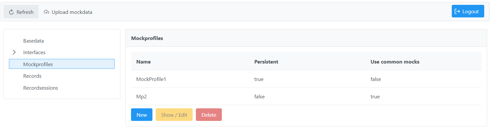
<ul>
<li>Name</li>
<li>Persistent</li>
<li>Use common mocks</li>
 
<li>On delete all non common mockdata assigned to only this mockprofile get deleted too</li>
</ul>
  

<u>Usage (mockdata)</u>

<ul>
<li>Mockdata is only valid for requests with defined mockprofile(s)</li>
</ul>
      

<a name="a17"/>

<strong><u>Mockprofile</u></strong>

<ul>
<li>Name</li>
<li>Persistent (if false delete on system boot)</li>
<li>Use common mocks (if true use global mocks)</li>
<li>Description</li>
</ul>
      

<a name="a18"/>

<strong><u>API-Client</u></strong>

<ul>
<li>Lets you integrate MoSy easily into your apps and your processes</li>
</ul>
 
<ul>
<li>See class MosyApiClient
<ul>
<li>Used by webfrontend as well</li>
</ul>
 
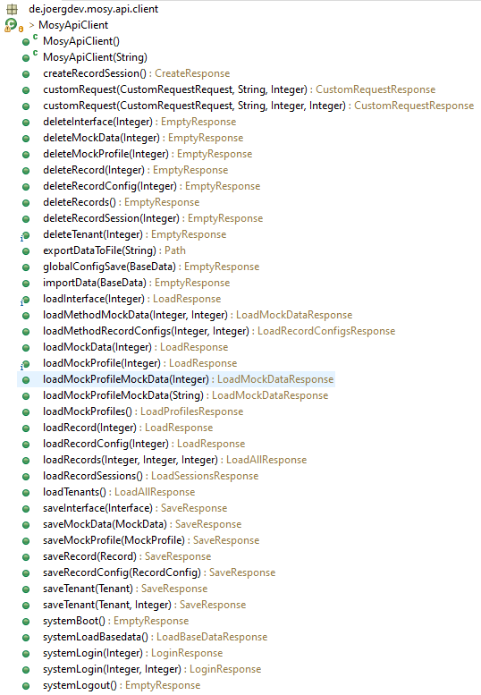
</li>
</ul>
      

<a name="a19"/>

<strong><u>Property files</u></strong>

<ul>
<li>Backend
<ul>
<li>properties
<ul>
<li>login_secret
<ul>
<li>Default = &bdquo;m0sy&ldquo;</li>
</ul>
</li>
<li>Api-client
<ul>
<li>properties
<ul>
<li>api_endpoint
<ul>
<li>Default = <a href="http://localhost:3911/mosy/api/v_2_1">http://localhost:3911/mosy/api/v_2_1</a></li>
</ul>
</li>
<li>properties</li>
</ul>
</li>
<li>Frontend
<ul>
<li>properties
<ul>
<li>upload_mockdata_singlemode
<ul>
<li>Defaultvalue = &bdquo;false&ldquo;</li>
</ul>
</li>
<li>properties</li>
<li>properties</li>
<li>properties</li>
<li>properties</li>
<li>properties</li>
</ul>
</li>
</ul>
</li>
</ul>
</li>
</ul>
</li>
</ul>
</li>
</ul>
      

<a name="a20"/>

<strong><u>Runtime environments &ndash; Spring Boot</u></strong>

Spring-boot Version: 2.1.3.RELEASE

 

<u>Projects:</u>

<ul>
<li>mosy-backend-standalone
<ul>
<li>Properties
<ul>
<li>META-INF/persistence.xml</li>
<li>properties
<ul>
<li>Port: 3911</li>
</ul>
</li>
<li>xml</li>
</ul>
</li>
<li>mosy-frontend-standalone
<ul>
<li>Properties
<ul>
<li>META-INF/faces-config.xml</li>
<li>properties
<ul>
<li>Port: 8087</li>
</ul>
</li>
<li>xml</li>
</ul>
</li>
</ul>
</li>
</ul>
</li>
</ul>
      

<a name="a21"/>

<strong><u>Runtime environments &ndash; JEE ApplicationServer (JBoss / Wildfly)</u></strong>

Tested and runnable with JBoss EAP 7.1.6 (JEE 7) with JDK8.

 

<u>Projects:</u>

<ul>
<li>mosy-backend-war
<ul>
<li>Properties (&hellip;/WEB-INF/)
<ul>
<li>xml</li>
<li>jboss-deployment-structure.xml
<ul>
<li>Add dependent module &bdquo;de.joergdev.mosy-backend&ldquo; for externalizing properties</li>
</ul>
</li>
<li>web.xml</li>
</ul>
</li>
<li>mosy-frontend-war
<ul>
<li>Properties
<ul>
<li>&hellip;/META_INF/
<ul>
<li>faces-config.xml</li>
</ul>
</li>
<li>&hellip;/WEB-INF/
<ul>
<li>xml</li>
<li>jboss-deployment-structure.xml
<ul>
<li>Add dependent modules &bdquo;de.joergdev.mosy-api-client&ldquo; and &bdquo;de.joergdev.mosy-frontend&ldquo; for externalizing properties</li>
</ul>
</li>
<li>web.xml
<ul>
<li>context-root: &bdquo;mosy-web&ldquo;</li>
</ul>
</li>
</ul>
</li>
</ul>
</li>
</ul>
</li>
</ul>
</li>
</ul>
</html>